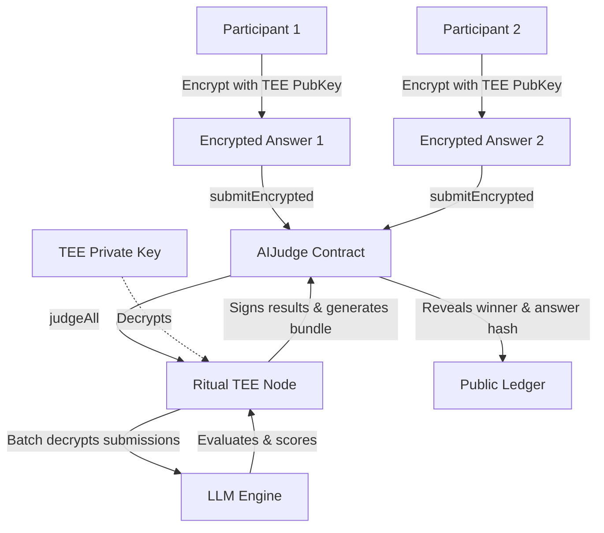

# Privacy-Preserving AI Bounty Judge

This repository contains the implementation for the Privacy-Preserving AI Bounty Judge system. It features two architectural approaches to prevent participants from frontrunning or copying others' submissions before judging is finalized.

1. **Commit-Reveal Flow** (Required Track): An on-chain cryptographic commit-reveal system that hides submissions until the submission deadline passes.
2. **Ritual-Native Hidden Submissions** (Advanced Track): A Trusted Execution Environment (TEE) backed architecture utilizing Ritual's privacy features to keep submissions completely encrypted on-chain and only decrypted inside the TEE during judging.

---

## 1. Commit-Reveal Lifecycle

The on-chain commit-reveal lifecycle operates as follows:

```mermaid
sequenceDiagram
    autonumber
    actor Owner as Bounty Owner
    actor Participant as Participant
    participant Contract as AIJudge Contract

    Note over Owner, Contract: 1. Setup Phase
    Owner->>Contract: createBounty(title, rubric, deadline, revealDeadline) + ETH Reward

    Note over Participant, Contract: 2. Submission Phase (time < deadline)
    Participant->>Contract: submitCommitment(bountyId, commitmentHash)
    Note right of Participant: commitmentHash = keccak256(answer, salt, msg.sender, bountyId)

    Note over Participant, Contract: 3. Reveal Phase (deadline <= time < revealDeadline)
    Participant->>Contract: revealAnswer(bountyId, answer, salt)
    Contract->>Contract: Verify hash matches commitment
    Contract->>Contract: Store answer in revealed submissions list

    Note over Owner, Contract: 4. Judging Phase (time >= revealDeadline)
    Owner->>Contract: judgeAll(bountyId, llmInput)
    Contract->>Contract: Call Ritual LLM Inference Precompile (Batch judging)
    Contract->>Contract: Store aiReview output

    Note over Owner, Contract: 5. Finalization Phase
    Owner->>Contract: finalizeWinner(bountyId, winnerIndex)
    Contract->>Participant: Transfer reward to winner
```

### Detailed Lifecycle Steps:
1. **Creation**: The bounty owner calls `createBounty(...)`, defining the submission `deadline` and the `revealDeadline`. The reward is locked in escrow within the contract.
2. **Commitment**: Participants compute `keccak256(abi.encodePacked(answer, salt, msg.sender, bountyId))` and submit only this 32-byte hash via `submitCommitment(...)` before the submission deadline. Plaintext answers remain entirely off-chain.
3. **Reveal**: After the submission deadline but before the reveal deadline, participants call `revealAnswer(...)` with their plaintext `answer` and `salt`. The contract verifies the hash against the stored commitment. If it matches, the answer is appended to the submissions list and the commitment is deleted to prevent double reveals.
4. **AI Judging**: After the reveal deadline, the owner calls `judgeAll(...)`, which invokes the Ritual `LLM_INFERENCE_PRECOMPILE` to batch-evaluate all revealed submissions.
5. **Finalization**: The owner reviews the AI's evaluations and selects the winner via `finalizeWinner(...)`. The contract pays the reward to the winner's address.

---

## 2. Advanced Track: Ritual-Native Hidden Submissions

While the commit-reveal flow protects answers during submission, answers become public during the reveal phase *before* judging takes place. To prevent any frontrunning or collusion between the reveal and judging phases, we can leverage a **Ritual-Native Hidden Submissions** design using TEE-backed execution.

### Architectural Diagram


### Technical Design Details:
1. **Plaintext Existence & Reading**: Plaintext answers exist only on the participant's local machine and inside the memory of the **Ritual TEE (Trusted Execution Environment) Node** during execution. No public party, including other participants, the bounty owner, or the network operators, can read the plaintext.
2. **On-Chain vs. Off-Chain Storage**:
   * **On-Chain**: The smart contract stores:
     * Encrypted submissions (or IPFS/Arweave content identifiers pointing to the encrypted data).
     * The TEE's public key (for participants to encrypt answers against).
     * The final revealed bundle hash (`revealedAnswersHash`) and reference (`revealedAnswersRef`) once judging completes.
   * **Off-Chain**: The raw encrypted answer files can be stored on decentralized storage (IPFS/Arweave) to save on-chain gas costs.
3. **Batch Judging**: When `judgeAll()` is called, the contract triggers the TEE execution. The TEE node pulls all encrypted submissions, decrypts them inside its secure enclave using its private key (derived via Ritual's DKMS/DKG), formats them into a single batch prompt, and calls the LLM. This prevents multiple expensive LLM calls.
4. **Final Reveal & Verification**: Once the TEE determines the winner, it generates a JSON bundle containing the scores, explanations, and all plaintext answers. It uploads this bundle to off-chain storage (e.g., IPFS), computes the hash, signs it, and sends the signature back to the contract. The contract verifies the TEE's signature, writes the bundle hash and winner index to on-chain state, and distributes the reward. Anyone can now fetch the public bundle and verify that its content matches the on-chain hash.

---

## 3. Test Plan

The test suite in [`hardhat/test/AIJudge.test.ts`](hardhat/test/AIJudge.test.ts) covers the following scenarios:

| Category | Test Case | Expected Behavior |
| :--- | :--- | :--- |
| **Bounty Creation** | Create bounty with valid parameters | Success; escrow reward locked, deadlines set |
| **Bounty Creation** | Create bounty with invalid deadlines | Revert if reveal deadline $\le$ submission deadline |
| **Commitment** | Submit commitment before deadline | Success; commitment registered |
| **Commitment** | Submit commitment after deadline | Revert ("submissions closed") |
| **Commitment** | Submit duplicate commitment | Revert ("already committed") |
| **Reveal** | Reveal answer before submission deadline | Revert ("submission phase not closed") |
| **Reveal** | Reveal answer during reveal phase with correct credentials | Success; answer stored, commitment cleared |
| **Reveal** | Reveal answer with incorrect answer, salt, or sender | Revert ("commitment mismatch") |
| **Reveal** | Reveal answer twice | Revert ("no commitment to reveal") |
| **Reveal** | Reveal answer after reveal deadline | Revert ("reveal phase closed") |
| **Judging** | Call `judgeAll` before reveal deadline | Revert ("reveal phase not ended") |
| **Judging** | Call `judgeAll` after reveal deadline | Success; triggers Ritual LLM precompile |

---

## 4. Reflection Question

**What should be public, what should stay hidden, and what should be decided by AI versus by a human in a bounty system?**

> In a decentralized bounty system, the bounty rules, rubric, reward escrows, participant identities (addresses), and the final evaluations must be public to guarantee transparency, trust, and auditability. Conversely, the participants' submissions must remain hidden during the active phases to prevent plagiarism and frontrunning, while the system's decryption keys should only exist within secure enclaves (TEEs) to protect privacy. The initial evaluation, batch grading, and scoring according to the public rubric should be decided by AI because it removes subjective bias, speeds up processing, and handles scale efficiently. However, the final selection of the winner and the release of funds must be decided by a human (the bounty owner or a decentralized multisig) to maintain accountability, provide a critical safety check against AI hallucinations, and handle edge cases that the AI rubric could not anticipate.
